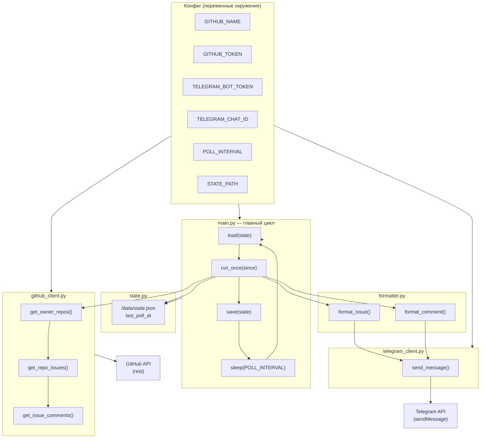

# Архитектура бота

## Схема

## Поток данных

1. **Старт** — загрузка конфига, проверка владельца GitHub, загрузка `last_poll_at` из `state.json`.
2. **Цикл (каждые POLL_INTERVAL сек):**
   - Запрос списка репозиториев владельца (GitHub).
   - Для каждого репо — запрос issues, обновлённых после `last_poll_at`.
   - Для каждого issue — запрос комментариев.
   - Новые issue/комментарии (created_at ≥ last_poll_at) форматируются и отправляются в Telegram.
   - Запись нового `last_poll_at` в `state.json`.
3. **Ожидание** — `sleep(POLL_INTERVAL)`, затем повтор цикла.

## Модули

| Модуль | Роль |
|--------|------|
| `main.py` | Цикл опроса, вызов клиентов, сохранение состояния, обработка RateLimitExceeded |
| `github_client.py` | Запросы к GitHub API (repos, issues, comments), обработка 403 rate limit |
| `telegram_client.py` | Отправка сообщений в чат (sendMessage) |
| `formatter.py` | Формирование текста уведомлений, экранирование HTML |
| `state.py` | Чтение/запись `last_poll_at` в JSON-файл |
| `config.py` | Чтение и валидация переменных окружения |

## Внешние зависимости

- **GitHub API** — получение репозиториев, issues, комментариев (REST, с пагинацией).
- **Telegram Bot API** — отправка сообщений в заданный чат (односторонняя).
