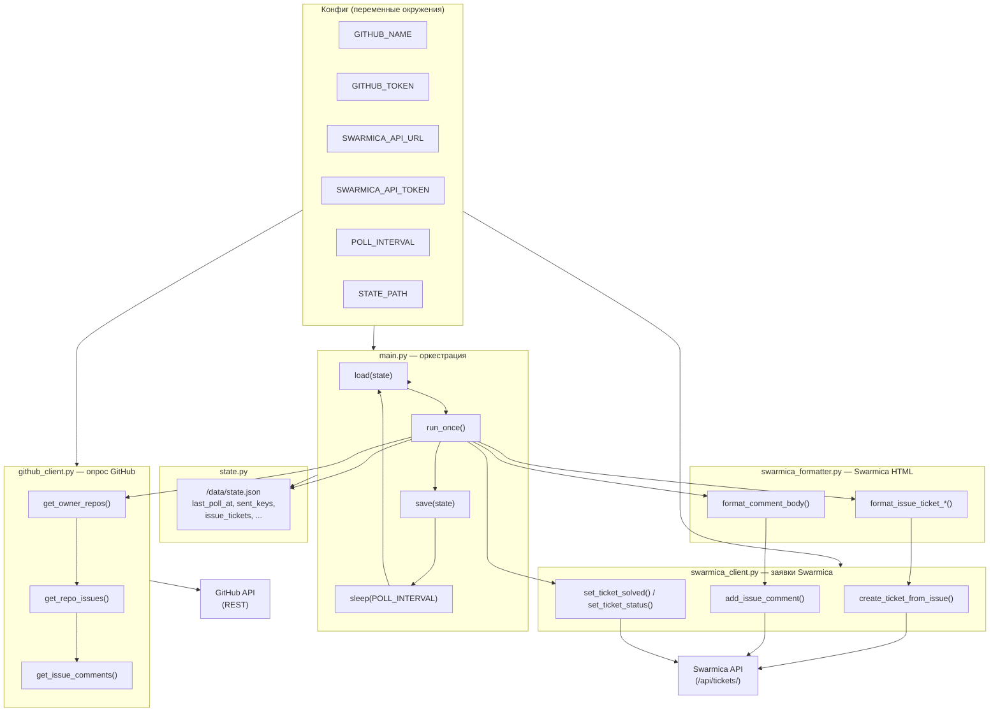

# Архитектура бота

> Telegram-уведомления отключены: пакет `bot/telegram/` (client, formatter, notifier, config) сохранён, но не импортируется из `main.py`. Точки подключения оставлены в `main.py` закомментированными (`# Telegram (disabled)`).

## Схема

```mermaid
flowchart TB
    subgraph env["Конфиг (переменные окружения)"]
        GITHUB_NAME
        GITHUB_TOKEN
        SWARMICA_API_URL
        SWARMICA_API_TOKEN
        POLL_INTERVAL
        STATE_PATH
    end

    subgraph main["main.py — оркестрация"]
        direction TB
        load_state["load(state)"]
        run_once["run_once()"]
        save_state["save(state)"]
        sleep["sleep(POLL_INTERVAL)"]
        load_state --> run_once --> save_state --> sleep --> load_state
    end

    subgraph github["github_client.py — опрос GitHub"]
        get_repos["get_owner_repos()"]
        get_issues["get_repo_issues()"]
        get_comments["get_issue_comments()"]
    end

    subgraph state["state.py"]
        state_file["/data/state.json\nlast_poll_at, sent_keys,\nissue_tickets, ..."]
    end

    subgraph swarm_fmt["swarmica_formatter.py — Swarmica HTML"]
        swarm_issue["format_issue_ticket_*()"]
        swarm_comment["format_comment_body()"]
    end

    subgraph swarmica["swarmica_client.py — заявки Swarmica"]
        create_ticket["create_ticket_from_issue()"]
        add_comment["add_issue_comment()"]
        set_solved["set_ticket_solved() / set_ticket_status()"]
    end

    env --> main
    env --> github
    env --> swarmica

    main --> load_state
    run_once --> get_repos
    get_repos --> get_issues
    get_issues --> get_comments
    run_once --> swarm_issue
    run_once --> swarm_comment
    swarm_issue --> create_ticket
    swarm_comment --> add_comment
    run_once --> set_solved
    main --> state_file
    run_once --> state_file

    github --> api["GitHub API\n(REST)"]
    create_ticket --> sw["Swarmica API\n(/api/tickets/)"]
    add_comment --> sw
    set_solved --> sw
```

## Поток данных

1. **Старт** — загрузка конфига, проверка владельца GitHub, загрузка состояния из `state.json`.
2. **Цикл (каждые POLL_INTERVAL сек):**
   - Запрос списка репозиториев владельца (GitHub).
   - Для каждого репо — запрос issues, обновлённых после `last_poll_at`.
   - Для каждого issue — запрос комментариев.
   - **Новый issue** (автор не из `IGNORE_COMMENT_AUTHORS`): создать заявку (заголовок и полный текст issue), сохранить `org/repo#N → ticket_id`.
   - **Новый комментарий** (полный текст + ссылка на комментарий):
     - клиент — добавить в заявку (создать, если ещё нет), статус `OPEN`;
     - автор из `IGNORE_COMMENT_AUTHORS` — добавить в существующую заявку, затем отдельным PATCH статус `PENDING` (для закрытого issue — `SOLVED`).
   - **Issue закрыт** (`state == closed`): статус `SOLVED` (один раз); не закрывается, если клиент написал после закрытия.
   - Запись нового `last_poll_at` и чекпоинтов в `state.json`.
3. **Ожидание** — `sleep(POLL_INTERVAL)`, затем повтор цикла.

## Модули

| Модуль | Роль |
|--------|------|
| `main.py` | Цикл опроса, синхронизация со Swarmica, сохранение состояния |
| `github_client.py` | Запросы к GitHub API (repos, issues, comments), обработка rate limit |
| `swarmica_client.py` | Создание заявок, комментариев и смена статусов в Swarmica API |
| `swarmica_formatter.py` | Текст заявок/комментариев для Swarmica (HTML) |
| `state.py` | `last_poll_at`, дедуп-ключи, маппинг issue → ticket |
| `config.py` | Чтение и валидация переменных окружения |
| `telegram/` | **Отключено.** Уведомления в Telegram: `client.py`, `formatter.py`, `notifier.py`, `config.py` |

## Внешние зависимости

- **GitHub API** — репозитории, issues, комментарии (REST, пагинация).
- **Swarmica API** — `POST /api/tickets/`, `POST /api/tickets/{id}/comments/`, `PATCH /api/tickets/{id}/` ([схема](https://support.swarmica.ru/api/schema/doc/)).
